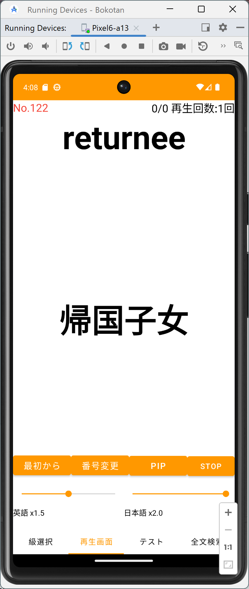
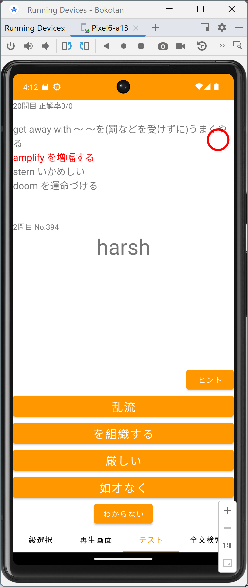

# Bokotan

Androidで動く英単語学習アプリです。

家から大学まで通うときに電車の中で英語音源を流して英単語を覚えたいという思いで開発しました。

単語データは単語帳を購入して、手打ち入力しています。音声データは出版社のサイトからダウンロードすることができます。

英語の音声はダウンロードできますが、日本語の音声はない場合があります。その時は、VOICEBOXを利用して作成しました。

# 注意

著作権の関係で、音声ファイルと日本語/英語のデータファイルはありません。

音声ファイルはスマホの内蔵ストレージのダウンロードフォルダ(/storage/emulated/0/Download/data)にあることを想定しています。

データファイルはapp/src/main/assetsにあることを想定しています。

# アプリの特徴

* パス単、ユメタン、単熟語EXに対応しています。
* 単語の日本語訳、英訳を確認しながら発音を確認できます。
* テストモードでは、英単語が表示されるので日本語訳4択から一つ選んで答えます。
* 検索モードでは、全単語とその訳から一括検索できます。

起動時の画面

再生画面

テストの画面

検索画面

# ビルドする方法

クローンしたフォルダをAndroid Studioで開きます(画像はWindows 10で開いた場合です)。

このままではビルドできないので、Add Configuration...をクリックします。このようなウィンドウが表示されます。

左上の+をクリックし、Android Appを選択します。

NameをAppにし、ModuleをBokotan.app.mainに設定します。

OKを押してウィンドウを閉じます。これで、ビルドができるようになります。

# その他

## JDKのエラーが出たとき

メニュー>File>Settings>Build, Execution, Deployment>Buid Tools>Gradle

からJDKパスの設定画面を開く。Gradle JDKのパスを

C:\Program Files\Android\Android Studio\jbr

にする。

## エラーが英語のとき

メニュー＞Help＞Edit Custom VM Options...を選ぶ
-Dfile.encoding=UTF-8
を追加する
